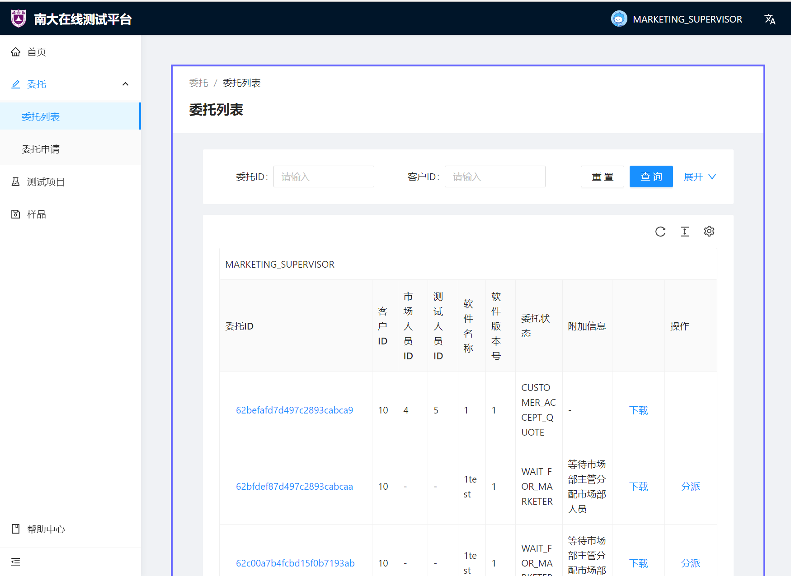
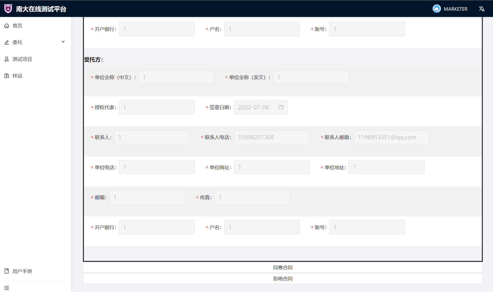

# **用户手册**

## **引言**

### **编写目的**

本文档给出项目的整体结构和功能结构概貌，从总体架构上给出系统的轮廓，对功能需求、性能需求等进行描述，便于用户、开发人员进行理解和交流，让开发人员在此基础上进行后续的设计和开发工作，使项目工作开展的各个过程合理有序，保证项目团队按时保质地完成项目目标。开发小组的软件系统实现与验证工作都以此文档为依据。

本文档的预期读者有开发人员、客户、各部门（市场部、质量部、测试部、档案室、样品室等）工作人员和系统管理人员。

### **项目背景**

”南大测试在线业务系统“是一个接受客户的委托，同时与南京大学软件测试中心进行交互，帮助客户进行软件测试整个业务流程的应用，主要部署在 Web 端。

“南大测试在线业务系统”的功能实现基于南京大学软件测试中心提供的软件测试服务，应用与测试中心形成相互合作的交互，测试中心通过应用向客户提交文件，并且返回相应的测评结果。交互过程中，相关工作人员同时也会对交互过程进行监督，以检验是否传输了有误的信息。

应用的所有信息都保存在后端服务器的数据库中。在网络良好的情况下，客户利用移动设备或者计算机与系统的服务器进行交互，过程中需要网络支持来上传或下载用于测试的文件、各类合同等，最终完成客户的目标。应用会保留每一次的具体服务情况。

## **应用概述**

### **目标**

该应用主要功能包括：

+ 用户管理：注册与维护用户；用户身份认证；用户授权；
+ 客户管理：客户注册；客户关系管理；客户查询；
+ 委托管理：在线委托；在线受理与审批；项目建立与查询；
+ 合同管理：合同创建、修改、删除、评审、查询等管理；
+ 样品管理：样品接受、流转、归还、归档、销毁、查询与维护；
+ 报告管理：报告编制、复核、批准、查询等管理；
+ 测试项目管理：
  + 项目支持文档管理；
  + 测试文档管理（测试方案、测试用例、测试记录、问题清单）；
  + 测试报告管理（报告编制、复核、形式检查、批准、查询等管理）；
  + 测试报告生成（从原始数据生成 PDF 正式文档）；

我们旨在为南大测试中心打造一个高效、稳定、实用的在线测试业务系统，也旨在借助本应用的开发过程提升团队成员的专业水平和实践能力。

本应用是一项独立的应用，且全部内容自含，与其他系统无关。

### **用户特点**

+ 用户：与本应用进行交互的人；
+ 管理员：测试中心系统管理人员；

### **假定和约束**

1. 开发截止日期：2022年7月xx日；
2. 所采用的方法和技术有限：项目团队成员需在开发过程中学习多种开发技术；
3. 在开发中，开发者要提交软件代码说明文档、用户手册和设计说明
4. 开发环境：windows/macOS/Linux，IntelliJ IDEA，VS Code，MySQL数据库，MongoDB数据库；

## **运行环境**

### **硬件**

<table>
    <tr>
        <td colspan="4" style="text-align:center">应用服务器配置</td>
    </tr>
    <tr>
        <td style="text-align:center">机器名（IP）</td>
        <td style="text-align:center">CPU</td>
        <td style="text-align:center">内存</td>
        <td style="text-align:center">软件环境（操作系统、应用软件）</td>
    </tr>
    <tr>
        <td style="text-align:center">210.28.133.13</td>
        <td style="text-align:center">Intel(R) Xeon(R) Silver 4114 CPU @ 2.20GHz, 8 Cores</td>
        <td style="text-align:center">16GB</td>
        <td style="text-align:center">Linux ubuntu 4.15.0-187-generic #198-Ubuntu SMP Tue Jun 14 03:23:51 UTC 2022 x86_64 x86_64 x86_64 GNU/Linux</td>
    </tr>
    <tr>
        <td colspan="4" style="text-align:center">客户端配置</td>
    </tr>
     <tr>
        <td style="text-align:center">172.26.30.68</td>
        <td style="text-align:center">Intel(R) Core(TM) i5-9300H CPU @ 2.40GHz, 4 Cores</td>
        <td style="text-align:center">16GB</td>
        <td style="text-align:center">Windows 10 家庭中文版 版本号 21H2 19044.1766</td>
    </tr>
</table>

### **软件**

<table>
    <tr>
        <td colspan="4" style="text-align:center">数据库服务器配置</td>
    </tr>
    <tr>
        <td style="text-align:center">机器名（IP）</td>
        <td style="text-align:center">软件环境（操作系统、应用软件）</td>
    </tr>
    <tr>
        <td style="text-align:center">124.221.156.98</td>
        <td style="text-align:center">MySql</td>
    </tr>
    <tr>
        <td style="text-align:center">124.221.156.98</td>
        <td style="text-align:center">MongoDB</td>
    </tr>
</table>

## **使用说明**

### **用户管理**

#### **登录**

未登录账号时打开网页，默认跳转至登录界面。

在登录界面，分别输入**用户名**、**密码**，点击**登录**，即可完成登录。

#### **注册**

在登录界面点击**注册账户**，跳转到注册界面。

在注册界面，分别输入**用户名**、**密码**、**确认密码**，即可完成注册。

注意：

+ 用户名只能包括**大小写字母**、**数字**和**下划线**，且长度不超过 32 个字符；
+ 密码长度无限制，但建议不要使用过短、容易被猜到的密码；
+ **确认密码**需与**密码**一致；

若已经注册过，点击**使用已有账户登录**即可返回登录界面；

#### **用户信息**

登录成功后，右上角状态栏会显示当前账户的**头像**和**用户名**（目前头像使用默认头像，不可自行更换）。

将鼠标移动到右上角状态栏上，可以显示账户管理相关操作，分别为**个人中心**、**设置**和**退出登录**：

+ 点击**个人中心**：进入个人信息界面，将显示当前账户的**用户名**、**用户ID**和**用户身份**；

+ 点击**设置**：进入设置界面，将显示**账户设置**和**管理员设置**两项：
  + **账户设置**：可以修改**用户名**和**密码**，所有用户均可访问该页面；
  + **管理员设置**：可以按照**用户名**或**用户身份**搜索用户信息，搜索内容将以列表形式列出，显示用户ID、用户名、用户角色；可以根据需要修改**用户身份**；
+ 点击**退出登录**：退出当前账户，返回登录界面；

### **客户**

#### **填写委托**

点击左侧导航栏中的**委托**，在下拉栏中点击**委托申请**，进入委托测试申请表填写界面。按照表格要求填写完毕后，点击提交即可。

注意：加 * 的内容是必填项，若留空会无法提交；同时，系统会对部分特殊项，例如邮箱等的格式进行检查，请确保正确填写。

#### **管理委托**

点击左侧导航栏中的**委托**，在下拉栏中点击**委托列表**，进入委托列表查看界面。

在委托列表查看界面，客户可以看到每个委托对应的**委托ID**、**客户ID**、**市场人员ID**、**测试人员ID**、**软件名称**、**软件版本号**、**委托状态**、**附加信息**等。同时，可以进行以下几项操作：

+ **查看委托**：选择要查看的委托，点击对应的**委托ID**，进入委托测试申请表查看页面；

+ **下载文档**：选择要查看的委托，点击对应的**下载**，进入文档下载页面，并点击所要下载的文档，在新打开的网页 PDF 中点击下载即可；

  注意：部分文档提示下载失败，请**先尝试检查网络连接状况**，若网络连接无问题且重试后仍然下载失败，可能是因为**该文件尚未上传**。

  客户可下载文档包括：

  + **NST－04－JS001－2011 软件项目委托测试提交材料**

  + **NST－04－JS002－2011 软件项目委托测试申请表**

  + **NST－04－JS003－2011 委托测试软件功能列表**

  + **NST－04－JS004－2011 软件委托测试合同**

  + **NST－04－JS005－2011 软件项目委托测试保密协议**

  + **NST－04－JS007－2011 软件测试报告**

  + **NST－04－JS014－2011 软件文档评审表**

  + **技术记录表格清单**

+ **查看进度**：选择要查看的委托，点击对应的**查看进度**，进入进度展示页面，客户可以在该页面浏览不同阶段的进度情况，并根据进展点击相应的步骤完成相关操作，例如**确认报价表**、**填写合同**、**确认报告**；

  

  

  

### **主管**

主管包括**市场部主管**、**测试部主管**和**质量部主管**，其可进行的操作是类似的：

+ 市场部主管：在**市场部分配人员阶段**，点击左侧导航栏中的**委托**，在下拉栏中点击**委托列表**，选择对应的委托，点击最右侧**分派**，进入分派人员界面。在分派人员界面，可根据**ID**、**姓名**和**职位**查找人员，选择要分派的市场部人员，点击右侧**分派**，在弹出对话框中点击**确定**，完成分派操作；
+ 测试部主管：在**测试部分配人员阶段**，点击左侧导航栏中的**委托**，在下拉栏中点击**委托列表**，选择对应的委托，点击最右侧**分派**，进入分派人员界面。在分派人员界面，可根据**ID**、**姓名**和**职位**查找人员，选择要分派的测试部人员，点击右侧**分派**，在弹出对话框中点击**确定**，完成分派操作；
+ 质量部主管：在**质量部分配人员阶段**，点击左侧导航栏中的**委托**，在下拉栏中点击**委托列表**，选择对应的委托，点击最右侧**分派**，进入分派人员界面。在分派人员界面，可根据**ID**、**姓名**和**职位**查找人员，选择要分派的质量部人员，点击右侧**分派**，在弹出对话框中点击**确定**，完成分派操作；

### **市场部人员**

一个市场部人员可以管理多份委托和对应的测试项目。

#### **管理委托**

点击左侧导航栏中的**委托**，在下拉栏中点击**查看**，进入委托列表查看界面。

在委托列表查看界面，市场部人员可以看到每个委托对应的**委托ID**、**客户ID**、**市场人员ID**、**测试人员ID**、**软件名称**、**软件版本号**、**委托状态**、**附加信息**等。同时，可以进行以下几项操作：

+ **查看委托**：选择要查看的委托，点击对应的**委托ID**，进入委托测试申请表查看页面；

+ **下载文档**：选择要查看的委托，点击对应的**下载**，进入文档下载页面。点击所要下载的文档，在新打开的网页 PDF 中点击下载即可；

  注意：部分文档提示下载失败，请**先尝试检查网络连接状况**，若网络连接无问题且重试后仍然下载失败，可能是因为**该文档尚未上传**。

  市场部人员可下载文档包括：

  + **NST－04－JS001－2011 软件项目委托测试提交材料**

  + **NST－04－JS002－2011 软件项目委托测试申请表**

  + **NST－04－JS003－2011 委托测试软件功能列表**

  + **NST－04－JS004－2011 软件委托测试合同**

  + **NST－04－JS005－2011 软件项目委托测试保密协议**

  + **NST－04－JS012－2011 软件项目委托测试工作检查表**

  + **NST－04－JS014－2011 软件文档评审表**

  + **技术记录表格清单**

+ **查看进度**：选择要查看的委托，点击对应的**查看进度**，进入进度展示页面。市场部人员可以在该页面浏览不同阶段的进度情况，并根据进展点击相应的步骤完成相关操作，例如**市场部审核委托**、**填写报价表**、**生成基本合同**、**合同评审**、**合同归档**、**发放报告**、**填写工作检查表**；

  

  

  

  

  

#### **管理测试项目**

点击左侧导航栏中的**测试项目**，进入测试项目列表查看界面。

在测试项目列表查看界面，市场部人员可以看到每个测试项目对应的**测试项目ID**、**委托ID**、**市场人员ID**、**测试人员ID**、**质量人员ID**、**测试项目状态**、**附加信息**等，并根据这些信息搜索对应的测试项目。同时，可以进行以下几项操作：

+ 点击**查看**，进入进度展示页面，与上文 **管理委托**-**查看进度** 相同；
+ 点击**下载**，进入文档下载页面，与上文 **管理委托**-**下载文档** 相同；

### **测试部人员**

一个测试部人员可以管理多份委托和对应的测试项目。

#### **管理委托**

点击左侧导航栏中的**委托**，在下拉栏中点击**查看**，进入委托列表查看界面。

在委托列表查看界面，测试部人员可以看到每个委托对应的**委托ID**、**客户ID**、**市场人员ID**、**测试人员ID**、**软件名称**、**软件版本号**、**委托状态**、**附加信息**等。同时，可以进行以下几项操作：

+ **查看委托**：选择要查看的委托，点击对应的**委托ID**，进入委托测试申请表查看页面；

+ **下载文档**：选择要查看的委托，点击对应的**下载**，进入文档下载页面。点击所要下载的文档，在新打开的网页 PDF 中点击下载即可；

  注意：部分文档提示下载失败，请**先尝试检查网络连接状况**，若网络连接无问题且重试后仍然下载失败，可能是因为**该文档尚未上传**。

  测试部人员可下载文档包括：

  + **NST－04－JS001－2011 软件项目委托测试提交材料**
  + **NST－04－JS002－2011 软件项目委托测试申请表**
  + **NST－04－JS003－2011 委托测试软件功能列表**
  + **NST－04－JS006－2011 软件测试方案**
  + **NST－04－JS007－2011 软件测试报告**
  + **NST－04－JS008－2011 测试用例（电子记录）**
  + **NST－04－JS009－2011 软件测试记录（电子记录）**
  + **NST－04－JS010－2011 测试报告检查表**
  + **NST－04－JS011－2011 软件测试问题清单（电子记录）**
  + **NST－04－JS012－2011 软件项目委托测试工作检查表**
  + **NST－04－JS013－2011 测试方案评审表**
  + **NST－04－JS014－2011 软件文档评审表**
  + **技术记录表格清单**

+ **查看进度**：选择要查看的委托，点击对应的**查看进度**，进入进度展示页面。测试部人员可以在该页面浏览不同阶段的进度情况，并根据进展点击相应的步骤完成相关操作，例如**测试部审核委托**、**填写测试方案**、**填写测试报告及文档**、**填写工作检查表**；

  

  

  

  

#### **管理测试项目**

点击左侧导航栏中的**测试项目**，进入测试项目列表查看界面。

在测试项目列表查看界面，测试部人员可以看到每个测试项目对应的**测试项目ID**、**委托ID**、**市场人员ID**、**测试人员ID**、**质量人员ID**、**测试项目状态**、**附加信息**等，并根据这些信息搜索对应的测试项目。同时，可以进行以下几项操作：

+ 点击**查看**，进入进度展示页面，与上文 **管理委托**-**查看进度** 相同；
+ 点击**下载**，进入文档下载页面，与上文 **管理委托**-**下载文档** 相同；

### **质量部人员**

一个质量部人员可以管理多份测试项目。

#### **管理测试项目**

点击左侧导航栏中的**测试项目**，进入测试项目列表查看界面。

在测试项目列表查看界面，质量部人员可以看到每个测试项目对应的**测试项目ID**、**委托ID**、**市场人员ID**、**测试人员ID**、**质量人员ID**、**测试项目状态**、**附加信息**等，并根据这些信息搜索对应的测试项目。同时，可以进行以下几项操作：

+ **下载文档**：选择要查看的测试项目，点击对应的**下载**，进入文档下载页面。点击所要下载的文档，在新打开的网页 PDF 中点击下载即可；

  注意：部分文档提示下载失败，请**先尝试检查网络连接状况**，若网络连接无问题且重试后仍然下载失败，可能是因为**该文档尚未上传**。

  质量部人员可下载文档包括：

  + **NST－04－JS001－2011 软件项目委托测试提交材料**
  + **NST－04－JS006－2011 软件测试方案**
  + **NST－04－JS007－2011 软件测试报告**
  + **NST－04－JS008－2011 测试用例（电子记录）**
  + **NST－04－JS009－2011 软件测试记录（电子记录）**
  + **NST－04－JS010－2011 测试报告检查表**
  + **NST－04－JS011－2011 软件测试问题清单（电子记录）**
  + **NST－04－JS012－2011 软件项目委托测试工作检查表**
  + **NST－04－JS013－2011 测试方案评审表**

+ **查看进度**：选择要查看的测试项目，点击对应的**查看进度**，进入进度展示页面。质量部人员可以在该页面浏览不同阶段的进度情况，并根据进展点击相应的步骤完成相关操作，例如**审核测试方案**、**上传评审表**、**审核测试报告**、**上传检查表**、**审核测试文档**、**填写工作检查表**；

  

  

  

  

  

### **样品管理**

点击左侧导航栏中的**样品**，进入样品列表查看界面。

+ 市场部人员、主管可以在全阶段查看或更新对应样品列表；

+ 测试部/质量部人员、主管只能查看样品列表，但不能进行操作；

+ 客户不能查看样品列表；